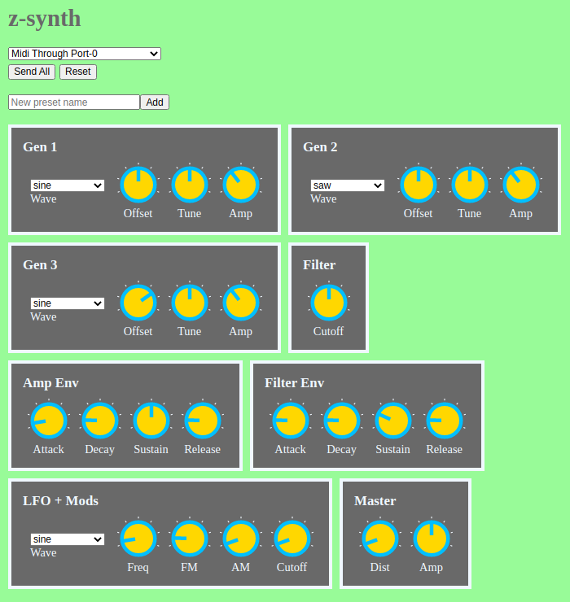

# z-synth

ALSA synth with a WebMIDI UI.

The internals of the synth are easily hackable. The design is standalone audio modules wired together in a DAG, with a central controller to make updates in response to MIDI messages.

[](https://elang.us/z-synth/controller-web/)

## Dependencies

Install ALSA dev libs:

```
apt install libasound2-dev
```

RxCpp 4.x is required. Follow the instructions [here](https://github.com/ReactiveX/RxCpp) to install it. Increasing system virtual memory may be required when compiling RxCpp on a raspi.

## Build

```
make
```

## Example usage

Start synth, connect midi:
```
# See audio output devices with `aplay -l`
./z-synth --device hw:0,0

# See midi input devices with `aconnect -i`
aconnect 16:0 z-synth:0
```

## Running tests

Google Test 1.x is required. Follow the instructions [here](https://github.com/google/googletest/blob/master/googletest/README.md) to install it.

```
make z-synth-test && ./z-synth-test
```
